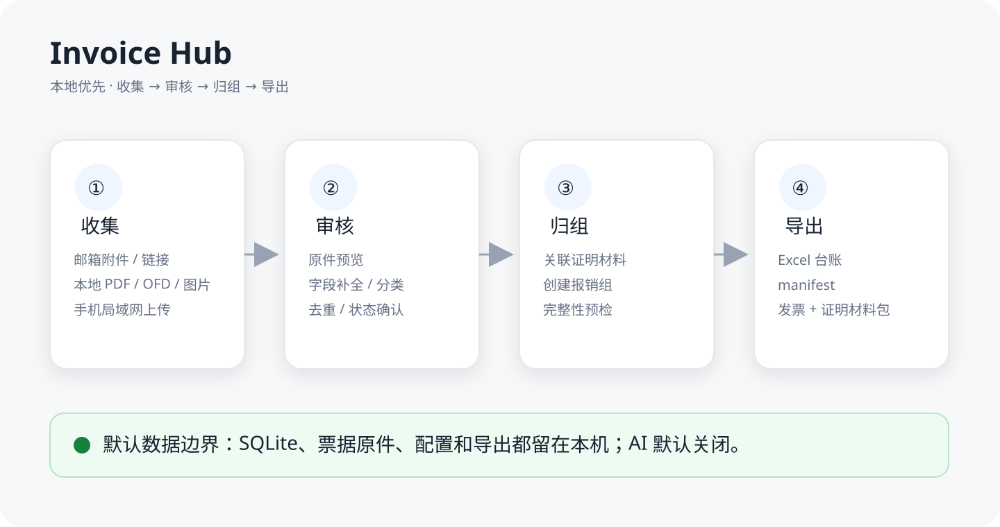

# Invoice Hub

**本地优先的发票审核与报销整理工具。**

| 源码发布线 | 上一已发布稳定版 | 实时发布状态 | 推荐 |
| --- | --- | --- | --- |
| [v0.1.8 release notes](docs/release-notes/v0.1.8.md) | [Invoice Hub v0.1.7](https://github.com/if16888/invoice-hub/releases/tag/v0.1.7) | 以 [GitHub Releases](https://github.com/if16888/invoice-hub/releases) 为准 | 普通用户使用 Releases 页面当前最新的非预发布正式版 |

> **发布真实性说明：**源码快照只记录版本线和历史稳定版，不硬编码会随 tag / Release 创建而变化的实时 publication state。v0.1.8 是否已经形成官方发布，以 GitHub Releases 页面为唯一权威。

Invoice Hub 是一个本地优先的报销资料整理助手，用来在提交报销前，把散落在邮箱、本地文件夹和手机里的发票、收据、截图、证明材料整理成可审核、可归组、可导出的资料包。

它不是企业费控系统，也不替代 Concur、飞书、钉钉、合思等企业报销平台；它专注于“提交之前”的个人整理环节。



> 概览图仅展示产品工作流与本地数据边界，不包含真实发票、邮箱、税号、金额、数据库、授权码或 API Key。

## 立即试用 Windows 版

### 普通用户优先

请先打开 [GitHub Releases 官方页面](https://github.com/if16888/invoice-hub/releases)，并先阅读 [Windows 下载与安装安全说明](docs/windows-install.md)，再在 Assets 中选择适合的文件。

- 普通用户优先使用 GitHub Releases 页面当前最新的非预发布正式资产。
- 参与候选版验证时，可下载对应 RC 的 `InvoiceHub-*-win64-setup.exe`，按提示安装后启动 `Invoice Hub`。
- 想免安装试用时，可下载对应版本的 `InvoiceHub-*-win64-portable.zip`，解压后运行其中的程序。
- `SHA256SUMS.txt` 是 SHA256 校验文件，用于确认下载文件没有损坏或在传输中发生变化。

> v0.1.8 是当前源码发布线；官方 tag、GitHub Release 和正式资产是否已经存在，只以 GitHub Releases 页面实时状态为准。

安装或解压后启动 `Invoice Hub`。建议先用少量脱敏样本试跑；确认流程符合预期后，再在本机导入自己的报销材料，并避免把运行数据上传到公开 Issue。

Windows 打包版采用 PyInstaller onedir 方式发布。当前打包策略会随程序携带 Playwright Python driver/Node 运行组件，但不打包 Chromium 等完整浏览器二进制；也默认不使用 UPX 压缩，以减少 Qt/PySide6 兼容问题和杀软误报概率。

### 开发者本地启动

普通开发安装：

```powershell
pip install -r requirements.txt
pip install -r requirements-desktop.txt
python -m scripts.invoice_fetch desktop
```

可复现排障或 release 候选验证时，可使用锁定依赖版本：

```powershell
pip install -r requirements.lock.txt
pip install -r requirements-desktop.lock.txt
python -m scripts.invoice_fetch desktop
```

`requirements*.txt` 保留宽松版本范围，便于普通开发环境安装；提交的 `requirements*.lock.txt` 以 Python 3.11 生成并由 CI / Windows release 工作流验证，用于复现当前开发、排障和发布环境。若贡献者使用其他 Python 版本，不应直接覆盖项目 lock 文件；需要升级依赖时，请在 Python 3.11 环境重新运行 `pip-compile`，同步更新相关 lock 文件并重新跑测试。

命令行入口：

```powershell
python -m scripts.invoice_fetch --help
python -m scripts.invoice_fetch --import-dir .\your_invoices_path
```

邮箱授权码不应写入 `config.json`。桌面应用会优先从 Windows Credential Manager 读取当前 Windows 用户的本机凭据；如需手工配置，请参考项目文档中的凭据设置说明。

## 解决什么问题

很多报销失败不是因为系统复杂，而是提交前资料没有整理好：

- 发票散落在邮箱、本地目录、手机相册和聊天记录里。
- 同一张发票可能重复下载、重复上传或文件名混乱。
- 发票字段解析不完整，需要人工补金额、日期、销售方、分类和备注。
- 需要把一批已确认的材料归到同一个报销组，再导出给企业报销系统或财务同事。
- 发票、收据、行程单、付款截图等证明材料经常分散保存，难以归到同一笔报销事项。

Invoice Hub 试图把这些提交前的整理动作放在本机完成。

## 工作流

**收集 -> 去重 -> 审核 -> 归组 -> 导出**

1. 收集：从 IMAP 邮箱、本地目录、手机扫码上传入口收集候选发票和证明材料。
2. 去重：根据文件哈希、发票号/金额/销售方等信息和已有记录减少重复材料。
3. 审核：在桌面工作台中查看原件、补全字段、调整分类、确认状态和备注。
4. 归组：把已确认的记录加入一个报销组，保留人工确认后的分类和说明。
5. 导出：生成 Excel 台账、manifest 和附件包，供后续提交或留档。

## 3 分钟上手

1. 下载并启动 Windows 安装包或 portable 包。
2. 先导入少量脱敏样本，或只导入一小批本机报销材料。
3. 在发票列表中查看原件预览，补全日期、销售方、金额、分类和备注。
4. 确认无误后，将记录标记为“已通过”。
5. 创建一个报销组，把已通过记录加入该组。
6. 点击“一键导出”，生成 Excel 台账、manifest 和附件包。

## 核心功能

- 桌面审核工作台：发票列表、搜索筛选、原件预览、字段编辑、审核状态、报销组操作，并在删除、恢复、关联、取消关联、重新解析和重新下载后尽量保留当前选中行和表格位置。
- 邮箱扫描：支持 QQ、163/126 和自定义 IMAP 配置。
- 邮件链接下载：可尝试从邮件中的发票下载链接或网页入口下载原件；浏览器自动化路径依赖 Playwright 运行链路以及可用的浏览器运行时。
- 本地导入：导入 PDF、OFD、图片和 ZIP，复制到本机应用数据目录后进入同一处理流程。
- 手机扫码上传：在局域网中从手机上传发票或证明材料。
- 报销组导出：生成 Excel 台账、manifest 和附件包。
- 隐私保护诊断：导出脱敏诊断包，便于反馈问题时避免泄露真实票据和密钥。

## 关于 Playwright

Invoice Hub 可尝试从邮件中的发票下载链接自动获取原件。该能力使用 Playwright 浏览器自动化组件。

当前 Windows 打包策略只携带 Playwright Python driver/Node 运行组件，不打包 Chromium 等完整浏览器二进制。因此，“Portable 包中没有 Chromium 可执行文件”本身不是异常；真正需要浏览器自动化的功能路径仍取决于运行环境是否具备可用浏览器或应用对应的降级处理。

如果浏览器自动化能力不可用，仍可通过邮箱附件、本地导入或手动补充原件完成整理流程。缺失原件时，应用会保留记录，用户可后续手工补充或重试下载。

## 当前状态

Invoice Hub 处于早期可试用阶段，重点是个人本地整理和提交前审核。

当前适合：个人先用少量真实或脱敏材料试跑导入 -> 审核 -> 归组 -> 导出闭环。

当前不建议：一次性导入大量正式材料并完全依赖自动解析结果。稳定用户请使用 GitHub Releases 页面当前最新的非预发布正式版，并继续人工复核解析结果和导出材料。

已覆盖的方向：

- 本地优先的数据存储和导出。
- 邮箱、本地目录、手机上传三类资料入口。
- 发票/收据证据的解析、分类、去重、人工审核和报销组导出。
- 发布前的隐私检查、静态发布边界检查和打包检查。

仍需谨慎对待：

- 解析结果需要人工复核，不应直接视为财务事实。
- 不提供企业审批流、自动报销、云同步或第三方报销平台自动提交。
- v0.1.8 的官方发布状态只从 GitHub Releases 读取，不从 `master`、`version.py` 或静态 README 文本推断。

## Windows 数据与凭据边界

Frozen Windows 应用的默认数据边界与“运行目录”并不是同一个概念：

- 数据库、配置和日志默认保存在当前 Windows 用户的 `%APPDATA%\InvoiceHub`。
- 默认导出目录使用 Windows Known Folder API 获取，通常为 `Documents\Invoice Hub\Exports`；用户选择自定义目录后保持其自定义设置。
- 邮箱授权码和 AI API Key 使用 Windows Credential Manager 保存，由 Windows 用户账户提供凭据隔离边界。
- `INVOICE_HUB_RUNTIME_DIR` 只用于隔离对应的运行文件/运行上下文，不会创建独立的 Windows Credential Manager 安全边界。

因此，在**同一个 Windows 用户**下使用不同 runtime 目录启动应用，仍可能读取该用户此前保存的 Invoice Hub 凭据，这是当前设计的预期行为，不代表读取了其他 Windows 用户的凭据。

同样，卸载后重装也不等价于“全新 Windows 用户首次安装”：当前卸载策略不会主动删除用户 AppData、Documents 中的用户数据或 Windows Credential Manager 中的凭据。这样可以避免卸载误删个人数据，但意味着测试 clean-user installation 时必须使用真正的新 Windows 用户/凭据环境。

## 配置说明

桌面端应用的“系统配置”现已升级为**系统配置中心**。它采用列表优先的布局，支持管理多个邮箱账号与多个 AI 模型配置。

### 1. 邮箱账号管理

- 支持配置多个邮箱账号（保存在 `email_accounts` 列表中），可以对每个账号单独开启/停用、编辑或删除。
- 每一个邮箱账号可单独设置扫描范围（如 `最近 3 个月` 或 `最近 12 个月`），防止不必要的旧邮件扫描。
- 邮箱授权码/密码通过 Windows Credential Manager 进行本机安全存储；凭据处于当前 Windows 用户的安全边界内，账号之间按应用定义的凭据标识进行区分。

### 2. AI 模型配置

- 支持保存多个 AI 配置（保存在 `ai_profiles` 列表中）。支持 DeepSeek 和 Gemini 接口。
- 可以在列表中通过点击“设为当前”来快速切换当前生效的 AI 模型；也可以通过“停用”或删除当前生效的配置来全局关闭 AI 分析功能。
- AI API Key 保存在 Windows Credential Manager 中，并通过 Profile ID 区分（凭据名称格式为 `invoice-hub:ai-profile:<profile_id>`）；跨 Windows 用户的凭据隔离由操作系统账户边界提供。

`config.example.json` 提供了包含多个邮箱及 AI 模版的完整参考。系统依旧兼容旧版的单邮箱和单 AI 配置，并在首次启动时自动备份旧配置。

## 隐私优先提示

- 默认不上传发票原件、邮件正文、PDF 文本、图片、SQLite 数据库或 Excel 导出包。
- Frozen Windows 应用的数据库、配置和日志默认保存在当前用户 `%APPDATA%\InvoiceHub`；默认导出目录通常位于当前用户的 `Documents\Invoice Hub\Exports`。
- 邮箱授权码或应用专用密码、AI API Key 应存入 Windows Credential Manager，不写入 `config.json`。
- AI 分类默认关闭。显式启用 AI 时，仅发送脱敏后的邮件主题和发件人，不发送附件、PDF 文本、图片、数据库或 Excel。
- `INVOICE_HUB_RUNTIME_DIR` 不是凭据沙箱；同一 Windows 用户下的不同 runtime 仍共享该用户的 Credential Manager 安全边界。
- 本机运行数据、导出包和任何凭据都不应提交到 Git 或上传到公开 Issue。

## 隐私与安全

- 诊断包采用 allowlist，仅包含允许导出的诊断字段，并对配置、日志、邮箱、URL 查询参数和秘密字段进行脱敏处理。
- 公开仓库提供 `scripts/check_repo_privacy.py` 和 `scripts/check_public_export.py` 用于提交前检查。
- `config.example.json` 只作为示例配置；真实账号、授权码和 API Key 不应提交。
- Windows Credential Manager 以当前 Windows 用户为凭据安全边界；同用户重装保留凭据与跨 Windows 用户凭据隔离是两个不同的测试场景。

更多说明见：

- [隐私与反馈说明](docs/privacy-and-feedback.md)
- [隐私数据流](docs/privacy-data-flow.md)
- [安全策略](SECURITY.md)

## 适合谁 / 不适合谁

适合：

- 经常需要整理个人报销材料的员工。
- 希望先在本机审核、补全、去重，再提交企业报销系统的用户。
- 需要同时处理邮箱发票、本地 PDF/OFD/图片和手机端材料的人。
- 关注隐私，希望默认不把原始票据和数据库上传到云端的用户。

不适合：

- 需要企业级审批流、预算控制、组织架构、自动付款或财务系统集成的团队。
- 需要自动提交到 Concur、飞书、钉钉、合思等平台的场景。
- 期望云同步、多端协作或自动审批的用户。
- 期望完全免人工审核的报销流程。

## 反馈问题

普通问题、体验反馈和功能建议请使用 [GitHub Issues](https://github.com/if16888/invoice-hub/issues/new/choose)。

安全或隐私漏洞不要提交公开 Issue，请按 [SECURITY.md](SECURITY.md) 中的安全反馈方式处理。

反馈 Bug 时，请优先上传应用生成的脱敏诊断包，或只提供脱敏后的操作步骤和错误信息。公开 Issue、截图和附件中不要包含真实发票、数据库、Excel 报销包、邮箱授权码、API Key、完整下载链接或其他敏感财务信息。

## 项目文档

- [用户快速开始](docs/user-quickstart.md)
- [Windows 下载与安装安全说明](docs/windows-install.md)
- [开发架构设计](docs/architecture.md)
- [项目开发路线](docs/roadmap.md)
- [标准 IMAP 邮箱配置](docs/generic-imap-mailboxes.md)
- [发布检查清单](docs/release-checklist.md)
- [已知问题](docs/known-issues.md)
- [PySide6/Qt 许可合规说明](docs/pyside6-license-compliance.md)

## 开发验证

发布或提交前运行：

```powershell
python -m unittest discover -v -s tests -p "test_*.py"
python -m scripts.invoice_fetch --help
python scripts/check_repo_privacy.py
python scripts/check_public_export.py .
python -m compileall -q scripts/invoice_fetch
git diff --check
```

不要提交 `runtime/`、`config.json`、真实发票、邮箱导出、Excel 报销包、数据库或任何密钥。

## License

Invoice Hub 采用 Apache License 2.0。第三方依赖和打包组件的许可说明见 [THIRD_PARTY_NOTICES.md](THIRD_PARTY_NOTICES.md)。
