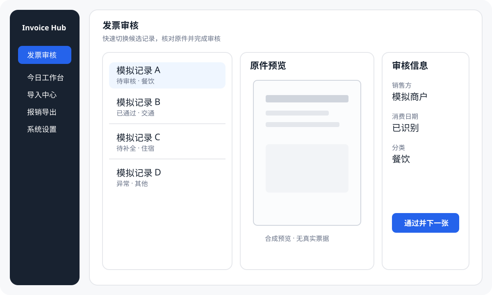
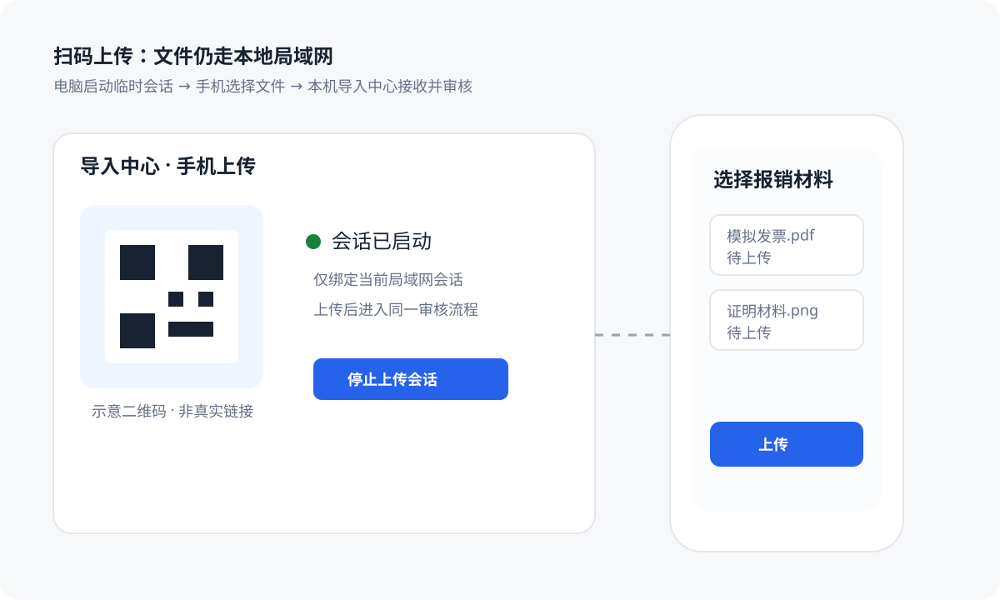

# Invoice Hub

**本地优先的发票审核与报销资料整理工具。**

Invoice Hub 把散落在邮箱、本地文件夹和手机里的发票、收据、行程单与证明材料，整理成一条可复核的本地工作流：

**收集 → 去重 → 审核 → 关联材料 → 报销归组 → 导出**

它不是企业费控系统，也不替代 Concur、飞书、钉钉、合思等平台；它专注于**提交报销之前**最费时间的个人整理环节。

| 源码发布线 | 上一已发布稳定版 | 实时发布状态 |
| --- | --- | --- |
| [v0.1.8 release notes](docs/release-notes/v0.1.8.md) | [Invoice Hub v0.1.7](https://github.com/if16888/invoice-hub/releases/tag/v0.1.7) | 以 [GitHub Releases](https://github.com/if16888/invoice-hub/releases) 为唯一权威 |

> 源码只记录当前 release line，不硬编码“是否已经正式发布”这种会随 tag / Release 改变的状态。

## 产品一览

下面的图片全部使用合成内容，只用于说明产品结构，不包含真实发票、邮箱、税号、金额、数据库、授权码、API Key 或本机私有路径。

### 发票审核工作台

列表、原件预览和审核字段处在同一个工作台内，适合连续审核、补字段、修改分类和“通过并下一张”。

### 手机局域网上传

桌面端启动临时上传会话，手机在同一可互通局域网中选择文件并上传；材料最终仍落到本机导入/审核流程。

### 报销组与导出

导出前检查审核状态、原件、必需证明材料和金额有效性，再生成 Excel、manifest 与附件资料包。

## 核心能力

| 能力 | 当前实现 |
| --- | --- |
| 邮箱收集 | QQ、163/126、自定义 IMAP；多账号独立启用、扫描范围与凭据 |
| 本地导入 | PDF、OFD、图片、ZIP；复制到本机数据目录，不移动原文件 |
| 手机上传 | 局域网临时会话，手机浏览器上传到桌面端 |
| 去重 | 文件哈希与业务身份组合，避免弱“销售方 + 金额”误杀 |
| 审核 | 原件预览、搜索过滤、字段修改、分类、状态、备注、连续审核 |
| 证明材料 | 发票/报销组材料关联，导出前检查可读性和必需状态 |
| 报销组 | 将已确认发票归组并检查完整性 |
| 导出 | Excel 台账、manifest、发票原件与证明材料包 |
| 诊断 | allowlist 脱敏诊断包，不导出数据库、原始票据或凭据 |
| AI | 可选、默认关闭；凭据保存在 Windows Credential Manager |

## 立即开始

### Windows 用户

打开 [GitHub Releases](https://github.com/if16888/invoice-hub/releases)，并先阅读 [Windows 下载与安装安全说明](docs/windows-install.md)。

Release Assets 中：

- **InvoiceHub-*-win64-setup.exe**：常规安装包，默认 per-user 安装。
- **InvoiceHub-*-win64-portable.zip**：免安装 portable 包。
- **SHA256SUMS.txt**：用于核对下载文件 SHA256。

建议第一次先使用少量**脱敏或可丢弃样本**完成一次“导入 → 审核 → 归组 → 导出”，确认流程符合自己的报销习惯，再使用正式材料。

### 开发者

当前开发、CI 与 Windows release 基线是 **Python 3.11**。

~~~powershell
pip install -r requirements.txt
pip install -r requirements-desktop.txt
python -m scripts.invoice_fetch desktop
~~~

需要复现 CI / release 环境时使用锁定依赖：

~~~powershell
pip install -r requirements.lock.txt
pip install -r requirements-desktop.lock.txt
python -m scripts.invoice_fetch desktop
~~~

常用命令：

~~~powershell
python -m scripts.invoice_fetch --help
python -m scripts.invoice_fetch --import-dir .\your_invoices_path
python scripts/dev/run_local_ci_preflight.py
~~~

## 隐私与数据边界

Invoice Hub 默认以**本机**为数据边界：

- Frozen Windows 应用的数据库、配置和日志默认位于当前用户的 **%APPDATA%\InvoiceHub**。
- 默认导出目录通常位于 **Documents\Invoice Hub\Exports**，也可由用户修改。
- 邮箱授权码、应用专用密码和 AI API Key 使用 Windows Credential Manager 保存，不应写入 config.json。
- 默认不把发票原件、邮件正文、PDF 文本、图片、SQLite 数据库或 Excel 报销包上传到云端。
- AI 默认关闭；启用 AI 时应遵循 [隐私数据流](docs/privacy-data-flow.md) 中记录的最小化边界。
- INVOICE_HUB_RUNTIME_DIR 只隔离运行文件，**不是**新的 Windows Credential Manager 安全边界。

公开 Issue、PR、截图和日志中不要上传真实发票、数据库、Excel 报销包、授权码、API Key、Cookie 或完整 tokenized URL。

更多信息：

- [隐私与反馈说明](docs/privacy-and-feedback.md)
- [隐私数据流](docs/privacy-data-flow.md)
- [安全策略](SECURITY.md)

## 当前限制

Invoice Hub 仍要求人工复核，不把解析结果当作最终财务事实。

当前主要限制：

- OFD、图片和扫描件的字段解析能力不如结构化 PDF，必要时需要手工补全。
- 邮件网页下载会受到登录、验证码、一次性链接过期和目标页面改版影响。
- 手机上传依赖电脑与手机处于可互通的局域网。
- Windows GitHub 直发包如果没有可信 Authenticode 签名或下载信誉，可能出现 SmartScreen / Unknown Publisher 提示。
- 不提供企业审批、预算控制、云同步、自动付款或直接提交企业费控系统。

详见 [已知问题](docs/known-issues.md)。

## 发布与质量门禁

常规开发先在本地运行：

~~~powershell
python scripts/dev/run_local_ci_preflight.py
~~~

稳定版发布还要求同一 exact SHA 的：

1. source/privacy/architecture gates；
2. unit shards + HCI acceptance；
3. Windows pre-tag build audit；
4. portable startup、版本身份和 payload hygiene；
5. Inno Setup 安装、启动、卸载链路；
6. 物理 Windows clean install / upgrade / restart persistence；
7. 100% / 125% / 150% DPI 人工验收。

完整要求见 [发布检查清单](docs/release-checklist.md) 和 [真实工作流验收](docs/REAL_WORKFLOW_ACCEPTANCE.md)。

## 文档

文档总入口：**[docs/README.md](docs/README.md)**

常用入口：

- [用户快速开始](docs/user-quickstart.md)
- [Windows 下载与安装安全说明](docs/windows-install.md)
- [架构与本地数据流](docs/architecture.md)
- [标准 IMAP 邮箱配置](docs/generic-imap-mailboxes.md)
- [隐私与反馈说明](docs/privacy-and-feedback.md)
- [发布检查清单](docs/release-checklist.md)
- [v0.1.8 release notes](docs/release-notes/v0.1.8.md)
- [项目路线](docs/roadmap.md)

## 反馈

普通 Bug、体验问题和功能建议请使用 [GitHub Issues](https://github.com/if16888/invoice-hub/issues/new/choose)。

安全或隐私漏洞不要提交公开 Issue，请按 [SECURITY.md](SECURITY.md) 中的方式反馈。优先使用应用生成的脱敏诊断包，并再次人工检查附件中没有真实票据或凭据。

## License

Invoice Hub 使用 Apache License 2.0。第三方依赖与打包组件许可见 [THIRD_PARTY_NOTICES.md](THIRD_PARTY_NOTICES.md)。
