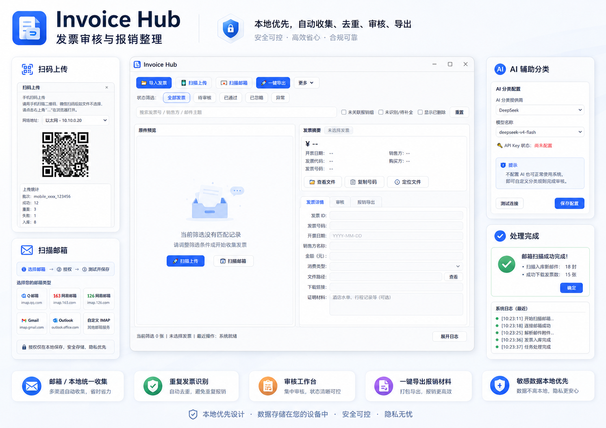

# Invoice Hub

**本地优先的发票审核与报销整理工具。**

| 当前公开下载版本 | 当前开发版本 | 状态 | 推荐 |
| --- | --- | --- | --- |
| [Invoice Hub v0.1.3-rc1](https://github.com/if16888/invoice-hub/releases/tag/v0.1.3-rc1) | Invoice Hub v0.1.3-rc1 | early preview / 早期可试用 | 先用少量脱敏样本试跑 |

Invoice Hub 是一个本地优先的报销资料整理助手，用来在提交报销前，把散落在邮箱、本地文件夹和手机里的发票、收据、截图、证明材料整理成可审核、可归组、可导出的资料包。

它不是企业费控系统，也不替代 Concur、飞书、钉钉、合思等企业报销平台；它专注于“提交之前”的个人整理环节。



> 预览图使用合成/脱敏示例数据，不包含真实发票、邮箱、税号、金额、数据库、授权码或 API Key。

## 立即试用 Windows 版

### 普通用户优先

请先打开 [Latest Release](https://github.com/if16888/invoice-hub/releases/latest)，在 Assets 中选择适合的文件：

- 推荐普通用户下载 `InvoiceHub-Setup-*.exe`，按提示安装后启动 `Invoice Hub`。
- 想免安装试用时，下载 `InvoiceHub-windows-x64-*.zip`，解压后运行其中的程序。
- `checksums.txt` 是 SHA256 校验文件，用于确认下载文件没有损坏。

安装或解压后启动 `Invoice Hub`。建议先用少量脱敏样本试跑；确认流程符合预期后，再在本机导入自己的报销材料，并避免把运行数据上传到公开 Issue。

Windows 打包版采用 PyInstaller onedir 方式发布。当前打包策略会随程序携带 Playwright Python driver，但不打包完整浏览器二进制；也默认不使用 UPX 压缩，以减少 Qt/PySide6 兼容问题和杀软误报概率。

### 开发者本地启动

普通开发安装：

```powershell
pip install -r requirements.txt
pip install -r requirements-desktop.txt
python -m scripts.invoice_fetch desktop
```

可复现排障或 release 候选验证时，可使用锁定依赖版本：

```powershell
pip install -r requirements.lock.txt
pip install -r requirements-desktop.lock.txt
python -m scripts.invoice_fetch desktop
```

`requirements*.txt` 保留宽松版本范围，便于普通开发环境安装；`requirements*.lock.txt` 由维护者当前 Python 3.14 环境生成，用于复现当前开发、排障和 release 候选验证环境。若贡献者使用其他 Python 版本，建议在对应环境下重新运行 `pip-compile` 生成自己的 lock 文件。发布前如升级依赖，请同步更新 lock 文件并重新跑测试。

命令行入口：

```powershell
python -m scripts.invoice_fetch --help
python -m scripts.invoice_fetch --import-dir .\your_invoices_path
```

邮箱授权码不应写入 `config.json`。桌面应用会优先从 Windows Credential Manager 读取本机凭据；如需手工配置，请参考项目文档中的凭据设置说明。

## 解决什么问题

很多报销失败不是因为系统复杂，而是提交前资料没有整理好：

- 发票散落在邮箱、本地目录、手机相册和聊天记录里。
- 同一张发票可能重复下载、重复上传或文件名混乱。
- 发票字段解析不完整，需要人工补金额、日期、销售方、分类和备注。
- 需要把一批已确认的材料归到同一个报销组，再导出给企业报销系统或财务同事。
- 发票、收据、行程单、付款截图等证明材料经常分散保存，难以归到同一笔报销事项。

Invoice Hub 试图把这些提交前的整理动作放在本机完成。

## 工作流

**收集 -> 去重 -> 审核 -> 归组 -> 导出**

1. 收集：从 IMAP 邮箱、本地目录、手机扫码上传入口收集候选发票和证明材料。
2. 去重：根据文件哈希、发票号/金额/销售方等信息和已有记录减少重复材料。
3. 审核：在桌面工作台中查看原件、补全字段、调整分类、确认状态和备注。
4. 归组：把已确认的记录加入一个报销组，保留人工确认后的分类和说明。
5. 导出：生成 Excel 台账、manifest 和附件包，供后续提交或留档。

## 3 分钟上手

1. 下载并启动 Windows 安装包或 portable 包。
2. 先导入少量脱敏样本，或只导入一小批本机报销材料。
3. 在发票列表中查看原件预览，补全日期、销售方、金额、分类和备注。
4. 确认无误后，将记录标记为“已通过”。
5. 创建一个报销组，把已通过记录加入该组。
6. 点击“一键导出”，生成 Excel 台账、manifest 和附件包。

## 核心功能

- 桌面审核工作台：发票列表、搜索筛选、原件预览、字段编辑、审核状态和报销组操作。
- 邮箱扫描：支持 QQ、163/126 和自定义 IMAP 配置。
- 邮件链接下载：可尝试从邮件中的发票下载链接或网页入口下载原件，该能力依赖 Playwright driver。
- 本地导入：导入 PDF、OFD、图片和 ZIP，复制到本机运行目录后进入同一处理流程。
- 手机扫码上传：在局域网中从手机上传发票或证明材料。
- 报销组导出：生成 Excel 台账、manifest 和附件包。
- 隐私保护诊断：导出脱敏诊断包，便于反馈问题时避免泄露真实票据和密钥。

## 关于 Playwright

Invoice Hub 可尝试从邮件中的发票下载链接自动获取原件。该能力依赖 Playwright 浏览器自动化组件，安装体积较大。

当前 Windows 打包策略只携带 Playwright Python driver，不打包完整浏览器二进制；如果没有可用浏览器或对应能力不可用，仍可通过邮箱附件、本地导入或手动补充原件完成整理流程。

如果只需要本地导入、已有附件解析和手动补原件，可以先跳过浏览器下载能力。缺失原件时，应用会保留记录，用户可后续手工补充或重试下载。

## 当前状态

Invoice Hub 处于早期可试用阶段，重点是个人本地整理和提交前审核。

当前适合：个人先用少量真实或脱敏材料试跑导入 -> 审核 -> 归组 -> 导出闭环。

当前不建议：一次性导入大量正式材料并完全依赖自动解析结果。

已覆盖的方向：

- 本地优先的数据存储和导出。
- 邮箱、本地目录、手机上传三类资料入口。
- 发票/收据证据的解析、分类、去重、人工审核和报销组导出。
- 发布前的隐私检查和打包检查。

仍需谨慎对待：

- 解析结果需要人工复核，不应直接视为财务事实。
- 不提供企业审批流、自动报销、云同步或第三方报销平台自动提交。

## 配置说明

`config.example.json` 只作为模板。新用户优先配置 `email_accounts`，这样可以同时管理多个邮箱账号。

顶层 `email` / `imap` / `search` 字段仍保留为兼容旧版单邮箱配置，也会作为 `email_accounts` 的默认值来源。新配置请优先写在每个 `email_accounts[]` 项中。

`username` 通常可以留空，程序会自动使用 `address` 作为登录用户名；如果邮箱服务商要求单独的登录名，再填写服务商指定的用户名。

真实邮箱授权码、应用专用密码和 API Key 不应写入示例文件或提交到仓库。桌面应用优先使用操作系统凭据管理器保存邮箱凭据。

## 隐私优先提示

- 默认不上传发票原件、邮件正文、PDF 文本、图片、SQLite 数据库或 Excel 导出包。
- 邮箱授权码或应用专用密码建议存入操作系统凭据管理器，不写入 `config.json`。
- AI 分类默认关闭。显式启用 AI 时，仅发送脱敏后的邮件主题和发件人，不发送附件、PDF 文本、图片、数据库或 Excel。
- 运行数据默认保存在本机 `runtime/`，不应提交到 Git 或上传到公开 Issue。

## 隐私与安全

- 诊断包采用 allowlist，仅包含脱敏日志、脱敏配置、环境摘要和隐私扫描结果。
- 公开仓库提供 `scripts/check_repo_privacy.py` 和 `scripts/check_public_export.py` 用于提交前检查。
- `config.example.json` 只作为示例配置；真实账号、授权码和 API Key 不应提交。

更多说明见：

- [隐私与反馈说明](docs/privacy-and-feedback.md)
- [隐私数据流](docs/privacy-data-flow.md)
- [安全策略](SECURITY.md)

## 适合谁 / 不适合谁

适合：

- 经常需要整理个人报销材料的员工。
- 希望先在本机审核、补全、去重，再提交企业报销系统的用户。
- 需要同时处理邮箱发票、本地 PDF/OFD/图片和手机端材料的人。
- 关注隐私，希望默认不把原始票据和数据库上传到云端的用户。

不适合：

- 需要企业级审批流、预算控制、组织架构、自动付款或财务系统集成的团队。
- 需要自动提交到 Concur、飞书、钉钉、合思等平台的场景。
- 期望云同步、多端协作或自动审批的用户。
- 期望完全免人工审核的报销流程。

## 反馈问题

普通问题、体验反馈和功能建议请使用 [GitHub Issues](https://github.com/if16888/invoice-hub/issues/new/choose)。

安全或隐私漏洞不要提交公开 Issue，请按 [SECURITY.md](SECURITY.md) 中的安全反馈方式处理。

反馈 Bug 时，请优先上传应用生成的脱敏诊断包，或只提供脱敏后的操作步骤和错误信息。公开 Issue、截图和附件中不要包含真实发票、数据库、Excel 报销包、邮箱授权码、API Key、完整下载链接或其他敏感财务信息。

## 项目文档

- [用户快速开始](docs/user-quickstart.md)
- [开发架构设计](docs/architecture.md)
- [项目开发路线](docs/roadmap.md)
- [标准 IMAP 邮箱配置](docs/generic-imap-mailboxes.md)
- [发布检查清单](docs/release-checklist.md)
- [已知问题](docs/known-issues.md)
- [PySide6/Qt 许可合规说明](docs/pyside6-license-compliance.md)

## 开发验证

发布或提交前运行：

```powershell
python -m unittest discover -v -s tests -p "test_*.py"
python -m scripts.invoice_fetch --help
python scripts/check_repo_privacy.py
python scripts/check_public_export.py .
python -m compileall -q scripts/invoice_fetch
git diff --check
```

不要提交 `runtime/`、`config.json`、真实发票、邮箱导出、Excel 报销包、数据库或任何密钥。

## License

Invoice Hub 采用 Apache License 2.0。第三方依赖和打包组件的许可说明见 [THIRD_PARTY_NOTICES.md](THIRD_PARTY_NOTICES.md)。
