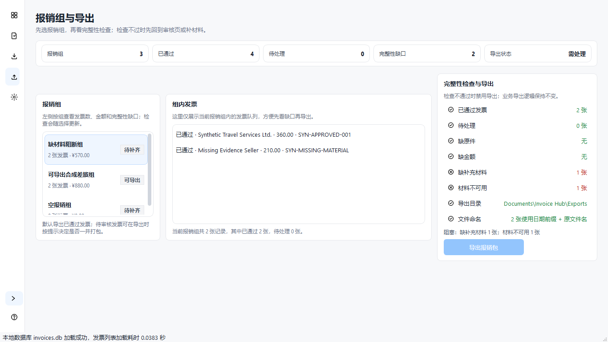

# F-001 修复后截图证据

- 页面/状态：`export / export-blocked`
- 尺寸：1366×768，Windows 原生窗口，100%，逻辑 DPI 96
- 提交基线：`51d6b5bd24db4ae5ac74cee8d58872c44e79fbb1`
- 数据：仅使用 `rc2-synthetic-complete-v1` 合成数据库；未使用真实发票、邮箱或密钥
- 实际结果：报销组显示“待补齐”；完整性缺口为 2；右侧显示“缺补充材料 1 张”和“材料不可用 1 张”；导出按钮禁用

机器可读信息见 [`f001-export-blocked-1366x768-100.json`](../../../tests/fixtures/synthetic/rc2-export-material-preflight/f001-export-blocked-1366x768-100.json)。
