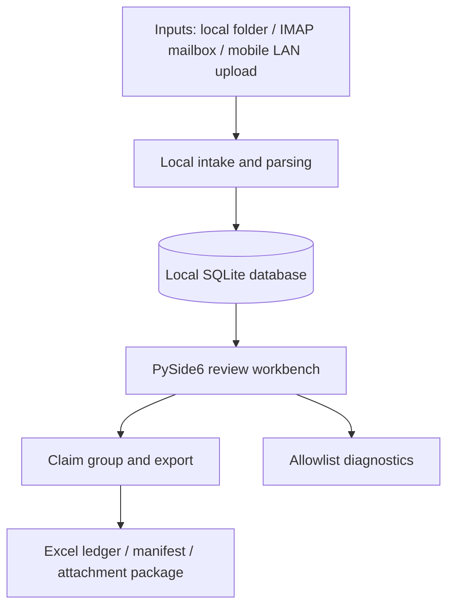

# Invoice Hub Architecture

Invoice Hub is an offline-first desktop tool for collecting, reviewing, grouping, and exporting personal reimbursement materials before they are submitted to a company expense system.

The default boundary is simple: **no cloud upload by default**. Parsing, indexing, review, and export happen on the user's local machine. Optional AI classification is disabled by default and must remain limited to documented redacted metadata.

## Data flow



## Main modules

| Path | Responsibility |
| --- | --- |
| `scripts/invoice_fetch/__main__.py` | CLI entry point and command dispatch. |
| `scripts/invoice_fetch_desktop.py` | Thin desktop launcher used by packaging. |
| `scripts/invoice_fetch/gui/app.py` | PySide6 main window, list/search/filter workflow, and top-level GUI actions. |
| `scripts/invoice_fetch/gui/invoice_detail_panel.py` | Right-side invoice detail and review panel. |
| `scripts/invoice_fetch/gui/helpers.py` | GUI helper functions for masking, manifest summaries, and stored-path resolution. |
| `scripts/invoice_fetch/db.py` | SQLite data access, invoice records, email records, claim groups, and review state. |
| `scripts/invoice_fetch/claim_export.py` | Claim package export, Excel ledger creation, manifest, and attachment packaging. |
| `scripts/invoice_fetch/config.py` | Config loading, provider presets, legacy config compatibility, and mailbox normalization. |
| `scripts/invoice_fetch/diagnostics.py` | Allowlist diagnostic package creation and redaction. |
| `scripts/invoice_fetch/ai_classifier.py` | Optional AI classification boundary; must not receive raw invoice files or email body content. |
| `scripts/invoice_fetch/db_backup.py` | SQLite backup helper for high-impact operations and manual recovery. |
| `scripts/invoice_fetch/backup_cli.py` | Standalone backup command. |
| `tests/` | Unit tests and GUI regression tests. |

## Configuration model

New users should prefer `email_accounts`, which supports multiple mailbox definitions. Top-level `email`, `imap`, and `search` remain for backward compatibility with older single-mailbox configs and as default values for mailbox entries.

Credentials should not be stored in `config.json`. The desktop app uses the operating system credential store where possible.

## Packaging notes

The Windows release uses PyInstaller onedir packaging. The spec bundles application metadata, license files, GUI assets, and the Playwright Python driver, but intentionally does not bundle full Playwright browser binaries. UPX is disabled in the current spec to reduce Qt/PySide6 compatibility issues and antivirus false positives.

## Privacy and diagnostics

Diagnostics use an allowlist model. A diagnostic package should include useful environment and log context, but must not include:

- `runtime/invoices.db` or other SQLite databases;
- original invoices, receipts, screenshots, or uploaded files;
- exported claim packages;
- mailbox authorization codes;
- AI API keys;
- full tokenized download URLs.

## Contributor orientation

For most small changes:

1. Start from the relevant module in the table above.
2. Add or update a focused test in `tests/`.
3. Run the targeted test, then the full unittest suite when possible.
4. Run the public export/privacy checks before submitting a PR.

Suggested checks:

```bash
python -m unittest discover -v -s tests -p "test_*.py"
python -m compileall -q scripts tests
python scripts/check_public_export.py .
git diff --check
```

## Architecture guard: stop adding acceptance patches

New product changes must live in the owning domain module. Do not extend the
GUI by adding new modules named like:

- `*_closure.py` or `*_vNN_closure.py`;
- `*_fix.py` or `*_fixes.py`;
- `*_baseline_pipeline.py`.

The existing closure/fix/baseline/contract files are grandfathered technical
debt. They may be removed or migrated incrementally after behavior-level tests
exist, but the checked-in baseline must shrink in the same PR and they must not
be copied into new pages or subpackages. The automatic name rule does not ban
all `*_contract.py` or `*_baseline.py` files: those names may represent valid
domain concepts. Existing files with those names remain explicitly recorded as
historical debt; any broader future ban requires a separate semantic policy.

Tests must derive from current user-observable behavior and current product
contracts:

```text
user-observable behavior / current product contract
                         ↓
                       tests
```

The reverse direction is prohibited:

```text
historical source-shape or internal-object assertion
                         ↓
hidden QWidget / QFrame / layout / compatibility-only production object
```

In particular, do not keep an obsolete `hasattr(...)`, `inspect(...)`, or
`findChild(...)` assertion passing by creating a hidden object in production
UI. Existing examples such as `review_legacy_contract.py`, legacy preview
controls, and hidden compatibility cards are debt to retire, not approved
extension patterns.

`scripts/check_architecture_policy.py` requires both checked-in debt snapshots
to equal the current findings. New debt fails the gate; stale baseline entries
also fail and instruct the contributor to shrink the corresponding baseline in
the same PR. The hidden-compatibility check remains deliberately conservative.
It does not ban ordinary `.hide()` or conditional visibility, because those are
valid UI behavior and a broad grep would create false positives. Human review
remains authoritative for patterns the conservative check cannot classify
reliably.
