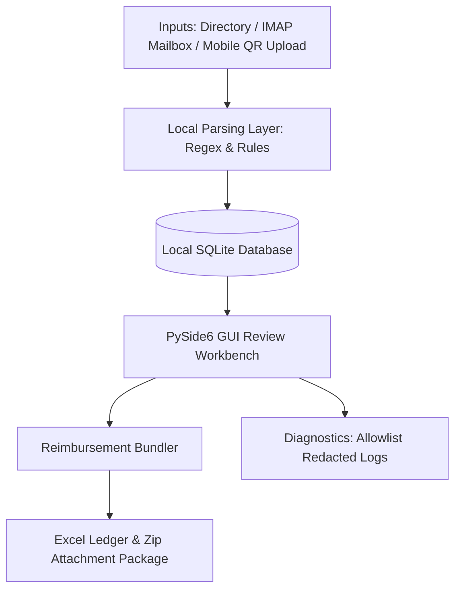

# Invoice Hub Architecture

This document describes the offline-first, privacy-respecting local architecture of **Invoice Hub**.

Every design decision in Invoice Hub is guided by the principle of **Zero Cloud Upload by Default**. Optional AI classification, when explicitly enabled, may send documented redacted email metadata only. All parsing, indexing, and storage happen entirely on the user's local machine.

---

## Architecture Flow Overview

The diagram below illustrates the sequential data flow of personal documents through the local system components:

---

## Component Breakdown

### 1. Data Ingestion (Inputs)
- **Local Directories**: Scans user-specified directories for PDF, OFD, and rasterized image files.
- **IMAP Mailbox Synchronizer**: Downloads emails matching local subject heuristics directly from secure mail servers. Mailbox passwords are never stored in plain text configuration files, relying instead on OS-level credential managers (e.g., Windows Credential Manager).
- **Mobile QR Code Upload**: Runs a temporary, local-only HTTP server over the LAN, allowing the user's mobile device to upload documents directly via a dynamically generated QR code without involving external cloud sync.

### 2. Local Parsing Layer
- A rule-based parser that executes lightweight regex matchers and structural filters to extract critical tax metadata (Unified Social Credit Code, invoice number, date, billing names, and total amounts).
- Performs extraction entirely offline in PySide6/Python processes, ensuring zero transmission of invoice content.

### 3. Local Storage Layer
- Keeps extracted records structured in a local **SQLite** database file.
- SQLite database logs and state are stored strictly in a `.db` file within local workspace directories. No cloud DB syncing is used.

### 4. Interactive GUI Workbench
- A desktop interface built on **PySide6** designed for high productivity.
- Allows table views of collected materials, instant searching, detail modifications, and custom categorization.
- Integrates a lazy-loaded local PDF/Image viewer that avoids pre-rendering delays.

### 5. Reimbursement Bundler & Exporter
- Packages reviewed items into a standard zip container.
- Generates a cleanly structured Excel `.xlsx` ledger (台账) mapping all original files to their corresponding metadata, tags, and classification labels.

### 6. Privacy-Redacted Diagnostics
- An allowlist-based log sanitizer that packages system configuration, synthetic/redacted logs, and general system stats into a zip bundle.
- The diagnostics exporter uses an allowlist and redaction rules to avoid including invoice files, databases, credentials, full URLs, and known sensitive patterns.
