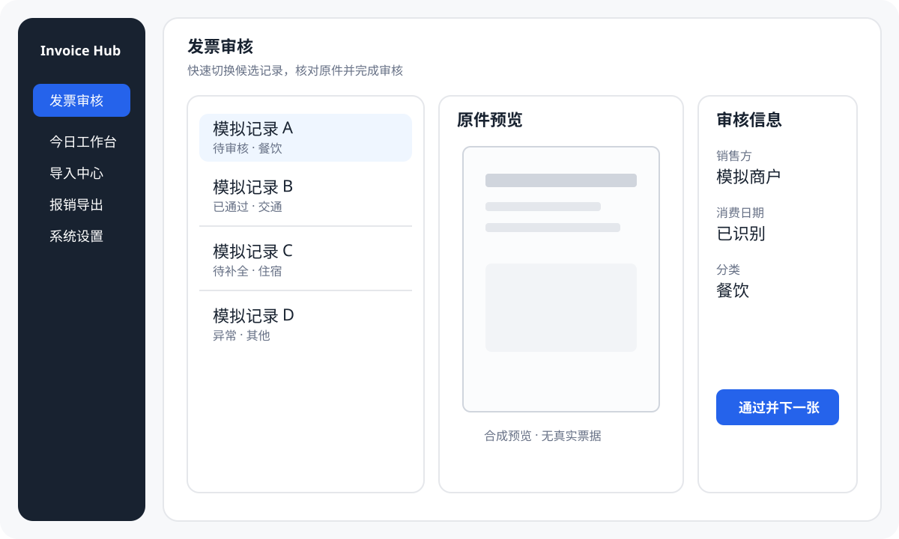

# 用户快速开始

Invoice Hub 用于**提交报销之前**的个人资料整理。第一次使用建议只导入少量脱敏或可丢弃样本，先完成一遍“导入 → 审核 → 关联材料 → 归组 → 导出”。

## 1. 安装与启动

Windows 用户优先从 [GitHub Releases](https://github.com/if16888/invoice-hub/releases) 获取当前最新的非预发布正式资产，并先阅读 [Windows 下载与安装安全说明](windows-install.md)。

- 安装包：**InvoiceHub-*-win64-setup.exe**
- Portable：**InvoiceHub-*-win64-portable.zip**
- 校验：**SHA256SUMS.txt**

开发环境：

~~~powershell
pip install -r requirements.txt
pip install -r requirements-desktop.txt
python -m scripts.invoice_fetch desktop
~~~

## 2. 先配置数据入口

主导航进入**系统设置**。

### 邮箱

支持 QQ、163/126 和自定义 IMAP。

1. 新增邮箱账号。
2. 选择 provider。
3. 输入邮箱地址。
4. 输入授权码/应用专用密码。
5. 测试连接并保存。
6. 按账号设置启用状态和扫描范围。

授权码/应用专用密码保存到 Windows Credential Manager，不应写入 config.json。

### AI（可选）

AI 默认关闭。需要时可添加 DeepSeek / Gemini profile，并将 API Key 保存在 Windows Credential Manager。

AI 不是完成报销闭环的必需项；不配置 AI 仍可正常导入、审核、归组和导出。

## 3. 导入材料

进入**导入中心**，可从三个入口收集材料：

- **邮箱扫描**：扫描已启用 IMAP 账号。
- **本地导入**：导入 PDF、OFD、图片或 ZIP。
- **手机上传**：在同一局域网中从手机浏览器上传。

本地导入会把材料复制到应用数据目录，不移动原始文件。

导入后先看本次结果：新增、重复、跳过和待人工检查项应能解释清楚；不要把“成功运行”理解为“所有字段都正确”。

## 4. 审核发票

进入**发票审核**。

建议按下面顺序核对：

1. 原件是否正确、可打开。
2. 消费/费用日期。
3. 发票号码/代码（如有）。
4. 销售方。
5. 购买方（如业务需要）。
6. 金额。
7. 分类。
8. 备注和证明材料要求。

可修改字段后保存；确认无误后使用“通过并下一张”连续处理。

无法确认的记录不要强行通过，可保留待审核、标记异常或稍后处理。

## 5. 关联证明材料

证明材料可以是行程单、付款证明、收据或其他业务附件。

关联后至少确认：

- 文件仍然存在并可打开；
- 材料确实属于当前发票/报销事项；
- 必需材料没有被当作“可选”跳过。

## 6. 创建报销组并导出

进入**报销导出**：

1. 新建或选择报销组。
2. 加入已审核通过的发票。
3. 查看完整性预检。
4. 处理缺原件、缺材料或金额异常。
5. 预检通过后生成报销包。

导出通常包含：

- Excel 台账；
- manifest；
- 发票原件副本；
- 已关联证明材料。

打开 Excel 和至少一个附件做人工抽查，再提交到企业报销系统。

## 7. 备份与重启检查

在设置页按用途选择备份：

- **完整备份**：保存数据库中的记录、审核状态、备注、报销组，以及已关联的发票原件和证明材料，生成 ZIP。适合换机恢复。
- **数据库备份**：仅保存数据库记录，不包含原件和证明材料。适合记录回滚；恢复后仍需原来的材料文件。

完整备份不包含邮箱授权码、API Key、配置、日志或尚未关联的上传文件；换机后需要重新配置邮箱和 AI。备份包没有加密，包含敏感财务数据，请保存在可信位置，不要用于公开反馈。只恢复自己创建或可信来源的备份；带有非应用触发器的数据库会被拒绝。

如果完整备份提示材料缺失，展开详情，按发票补齐原件或证明材料后重试。可以先创建数据库备份保留记录，但这不代表材料已经备份。

完成一轮整理后建议：

1. 创建完整备份，确认成功提示与备份文件；
2. 关闭应用；
3. 重新启动；
4. 确认审核状态、备注、报销组、配置和布局仍然正确。

换机时，在新电脑的设置页选择完整恢复并确认覆盖当前记录；恢复会保留覆盖前的数据库安全副本。完成后抽查发票原件、证明材料、备注及报销组，再执行导出预检。恢复包校验失败时原数据保留，按错误提示处理后重试。

## 8. 反馈问题

优先使用应用提供的：

- 打开日志目录；
- 复制诊断信息；
- 导出脱敏诊断包；
- 打开 GitHub Issues。

公开反馈时不要上传真实发票、数据库、Excel 报销包、邮箱授权码、API Key、Cookie 或完整下载链接。

更多文档见 [文档导航](README.md)。
